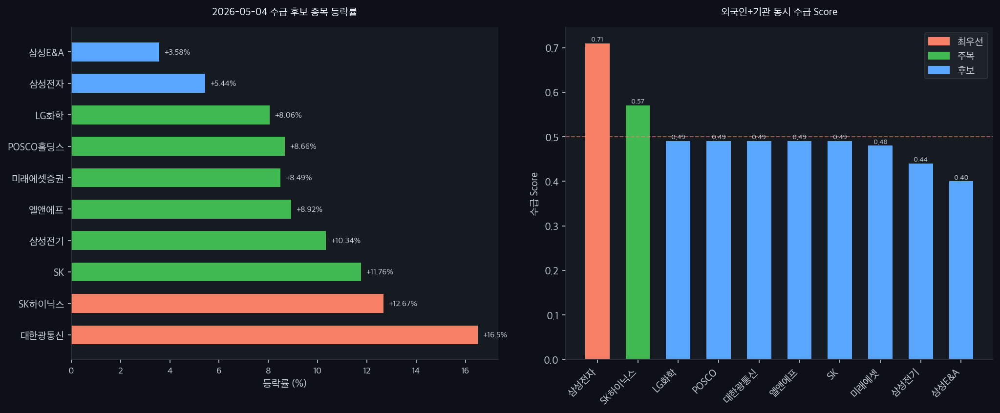

## 오늘, 코스피가 역사를 썼다

2026년 5월 4일 오후 3시. 코스피 지수가 6,900선을 돌파하며 **7,000 고지가 눈앞**에 왔습니다.

삼성전자는 하루 만에 5.44% 뛰었고, SK하이닉스는 무려 **+12.67%** 급등하며 시가총액 **1,000조 원**을 돌파하는 역사적 기록을 세웠습니다.

이런 날, 진짜 중요한 질문이 하나 있습니다.

> **"오늘 외국인과 기관은 어디에 돈을 넣었는가?"**

이 글은 그 질문에 대한 데이터 기반 답변입니다.

---

*Figure 1: 2026-05-04 외국인+기관 동시 수급 교집합 상위 10종목 — 등락률(좌)과 수급 Score(우)*

---

## 종가배팅 수급 스캔이란?

**종가배팅 수급 스캔**이란, 장 마감 직전(15:10~15:22 KST) 외국인과 기관이 **동시에 순매수**한 종목을 자동으로 추려내는 분석 방법입니다.

쉽게 말해, 프로 투자자 두 세력이 같은 날 같은 종목을 함께 사고 있다면 — 무언가 이유가 있다는 신호입니다.

오늘 분석 조건:

| 항목 | 기준 |
|------|------|
| 수급 모드 | `strict-intersection` (외국인+기관 교집합) |
| Score 모드 | `strict` |
| 후보 소스 | 30종목 |
| 최종 생존 | **10종목** |

> ⚠️ 이 분석은 투자 권유가 아닙니다. 수급 데이터를 기반으로 한 개인 기록이며, 모든 투자 판단과 책임은 본인에게 있습니다.

---

## 오늘의 수급 TOP 10 분석

### 1위. 삼성전자 (005930) — Score 0.71 🎯

오늘의 가장 눈에 띄는 수급 신호가 나온 종목입니다.

- **현재가:** 232,500원 (+5.44%)
- **고가 유지율:** 100% (종가 = 고가)
- **거래대금:** 6조 9,186억 원
- **프로그램 매수:** 최근 9구간 중 **7회 연속 증가**
- **외국계 순매수:** JP모간 +277만주, 골드만삭스 +140만주, 모건스탠리 +77만주

고가를 지킨 채 마감한다는 건 매도 압력을 전부 소화했다는 의미입니다. 프로그램 매수가 9구간 중 7번이나 들어온 것도 기관의 적극적 수급을 보여줍니다. 외국계 합산 +338만주는 단순한 수급을 넘어선 **확신 매수**에 가깝습니다.

---

### 2위. SK하이닉스 (000660) — Score 0.57 💥

오늘의 주인공입니다.

- **현재가:** 1,449,000원 (+12.67%)
- **시가총액:** **1,000조 원 돌파** (장중 달성)
- **거래대금:** 7조 3,550억 원
- **고가 유지율:** 99.9%
- **외국계:** JP모간·모건스탠리·UBS·골드만삭스 4사 동반 순매수

하루에 12.67% 오르고도 고가를 지킨 채 마감했습니다. 매수세가 그만큼 강했다는 뜻입니다. 시총 1,000조 돌파는 단순한 숫자가 아니라 **글로벌 기관 편입 기준 충족**을 의미하기도 합니다.

---

### 3위~4위. 소재주 쌍두마차: LG화학 + POSCO홀딩스

**LG화학 (051910)** — Score 0.49

- 현재가 429,000원 (+8.06%), 거래대금 2,454억
- 목표가 520,000원 리포트 (한국투자증권) 발표
- 외국계 4사 소폭 순매수

**POSCO홀딩스 (005490)** — Score 0.49

- 현재가 502,000원 (+8.66%), 거래대금 5,276억
- **기관 5일 연속 순매수** — 이 시그널이 핵심입니다
- 리튬 회복 기대감 + 깜짝 실적이 재료
- 신한투자증권 목표가 520,000원 제시

POSCO홀딩스의 기관 5일 연속 매수는 단순 단타가 아닌 **포지션 축적**으로 읽힙니다.

---

### 주목 이슈: 대한광통신 (010170) — Score 0.49 🌅

- **현재가:** 17,650원 (+16.50%)
- **거래량:** 8,233만주 (전일 대비 **2.52배**)
- **거래대금:** 1조 4,265억 원

거래량 폭발과 함께 상한가에 근접했습니다. 외국인은 순매도였지만 기관이 받쳐주며 고가 97% 유지. 단기 모멘텀 집중 종목이지만, 거래량이 이 정도면 다음날 동향을 주시할 필요가 있습니다.

---

## 오늘 시장 전체 흐름 정리

| 섹터 | 대표 종목 | 특징 |
|------|----------|------|
| 반도체 | 삼성전자, SK하이닉스 | 외국인+기관 동반, 외국계 4사 일제 매수 |
| 소재/화학 | LG화학, POSCO홀딩스, 엘앤에프 | 기관 5일 연속, 리튬 회복 기대 |
| 지주/금융 | SK (+11.76%), 미래에셋증권 (+8.49%) | 외국계 주도 돌파 |
| 광통신 | 대한광통신 | 거래량 폭발형 단기 이벤트 |
| EPC/건설 | 삼성E&A | 코스피 랠리 수혜 + 조용한 축적 |

---

## 3가지 핵심 시사점

**첫째, 외국계 4사(JP모간·모건스탠리·UBS·골드만삭스)가 같은 날 같은 종목을 샀다.**
이건 우연이 아닙니다. 글로벌 리포트나 인덱스 리밸런싱과 연동된 조직적 매수일 가능성이 높습니다.

**둘째, 코스피 7,000 돌파 전 마지막 포지션 축적 구간일 수 있다.**
기관이 5일 연속 POSCO홀딩스를 사고, 프로그램 매수가 삼성전자에 7/9 구간 들어왔다면 — 이건 단기 트레이딩이 아니라 중기 포지셔닝 신호입니다.

**셋째, 반도체 > 소재 > 금융 순의 순환매 패턴이 시작됐을 수 있다.**
대형 반도체가 먼저 뛰고, 뒤이어 소재(LG화학·POSCO)와 금융(미래에셋)이 따라오는 흐름은 전형적인 강세장 순환 패턴입니다.

---

## 자주 묻는 질문 (FAQ)

**Q: 종가배팅 수급 스캔은 어떤 원리인가요?**
A: 외국인과 기관의 순매수 데이터를 교집합(AND 조건)으로 필터링합니다. 두 세력이 같은 종목을 같은 날 순매수했을 때만 후보로 선정하며, 프로그램매매 추이·고가 유지율·외국계 브로커 강도를 결합해 최종 score를 산출합니다.

**Q: Score가 높으면 무조건 사야 하나요?**
A: 아닙니다. Score는 수급 강도의 상대적 순위일 뿐이며, 당일 시황·기업 펀더멘털·개인 리스크 허용 범위를 함께 고려해야 합니다. 이 분석은 투자 권유가 아닙니다.

**Q: 삼성전자 score가 0.71인데 SK하이닉스(0.57)보다 오히려 등락률이 낮은 이유는?**
A: Score는 등락률이 아닌 수급 구조의 안정성을 측정합니다. 삼성전자는 프로그램 매수 연속성·고가 유지율·외국계 순매수 규모 모두 고르게 높아 score가 높습니다. SK하이닉스는 등락률은 컸지만 수급 연속성 점수가 낮아 score가 상대적으로 낮게 나온 것입니다.

**Q: 이 데이터는 어디서 가져오나요?**
A: 한국투자증권 OpenAPI(KIS)를 통해 실시간 수급 데이터를 수집하고, 자체 스캔 시스템으로 처리합니다.

---

## 한 줄 결론

> 코스피 7,000을 향해 달리는 이 장에서, 외국계 4사와 기관이 함께 선택한 종목은 **삼성전자·SK하이닉스·POSCO홀딩스**였다. 돈의 흐름은 이미 말하고 있다.

---

*이 글은 KIS OpenAPI 기반 개인 수급 분석 기록입니다. 투자 결과에 대한 책임은 본인에게 있습니다.*

*작성: 김과장 | 오만 소하르 EPC 현장에서 퇴근 후 분석*
