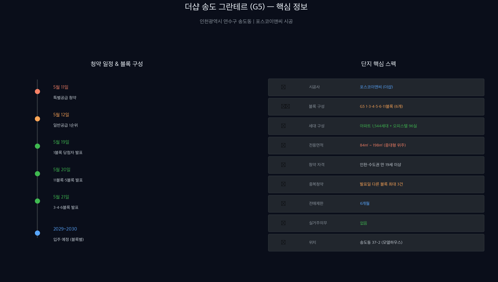
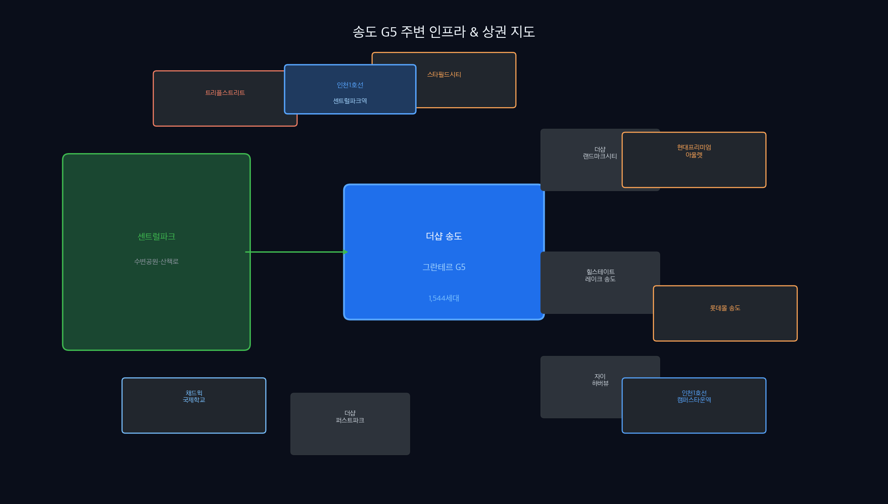

## 송도에서 가장 오래 기다린 분양이 드디어 온다

"송도에 집 사고 싶다"는 말을 해본 적 있으신가요?

인천 송도국제도시는 센트럴파크, 채드윅 국제학교, 트리플스트리트, 쌍용 C&E 공원까지 — 한국에서 가장 계획적으로 설계된 도시 중 하나입니다. 그 핵심 입지인 **G5(5공구)에 포스코이앤씨의 더샵 브랜드**가 들어옵니다.

이름하여 **더샵 송도 그란테르(The Sharp Songdo Granterre)**.

2026년 5월 청약을 앞두고, 이 글 하나로 모든 걸 정리해드립니다.

---


*Figure 1: 더샵 송도 그란테르 핵심 스펙 및 청약 일정 (2026년 5월 기준)*

---

## 더샵 송도 그란테르란?

**더샵 송도 그란테르**는 인천광역시 연수구 송도동, G5(5공구)에 들어서는 대규모 주거 단지입니다.

시공사는 **포스코이앤씨**. 더샵 브랜드는 이미 송도에서 랜드마크시티, 퍼스트파크, 센트럴파크 등으로 검증된 프리미엄 브랜드입니다.

> **'그란테르(Granterre)'**란 프랑스어로 '위대한 땅'을 뜻합니다. 송도라는 땅 위에 짓는 새로운 랜드마크라는 의미를 담고 있습니다.

**단지 기본 정보:**

| 항목 | 내용 |
|------|------|
| 정식 명칭 | 더샵 송도 그란테르 |
| 위치 | 인천광역시 연수구 송도동 (G5 구역) |
| 시공사 | 포스코이앤씨 |
| 세대 수 | 아파트 1,544세대 + 오피스텔 96실 |
| 전용면적 | 84㎡ ~ 198㎡ (중대형 위주) |
| 블록 구성 | G5 1·3·4·5·6·11블록 (6개 블록) |
| 입주 예정 | 2029년 8월 ~ 2030년 1월 (블록별 상이) |
| 모델하우스 | 인천광역시 연수구 송도동 37-2 |

---

## 청약 일정 완전 정리

### 핵심 일정

| 내용 | 날짜 |
|------|------|
| 입주자 모집공고 | 2026년 4월 30일 전후 |
| **특별공급 청약** | **2026년 5월 11일** |
| **일반공급 1순위** | **2026년 5월 12일** |
| 당첨자 발표 | 2026년 5월 19일 ~ 21일 (블록별) |
| 계약 | 발표 후 순차 진행 |
| 입주 예정 | 2029년 8월 ~ 2030년 1월 |

> ⚠️ 최종 일정은 반드시 공식 입주자 모집공고문으로 다시 확인하세요.

### 블록별 당첨자 발표일

| 발표일 | 해당 블록 |
|--------|----------|
| 5월 19일 | **1블록** |
| 5월 20일 | **11블록, 5블록** |
| 5월 21일 | **3블록, 4블록, 6블록** |

---

## 이 청약의 핵심 — 중복청약 전략

더샵 송도 그란테르의 가장 특별한 점은 **중복청약이 가능하다**는 것입니다.

### 중복청약 원리

- **당첨자 발표일이 같은 블록** → 1건만 청약 가능
- **당첨자 발표일이 다른 블록** → 중복청약 가능

즉, 발표일 그룹이 3개(19일/20일/21일)로 나뉘어 있어 **최대 3건까지 청약**이 가능합니다.

### 중복청약 전략 예시

```
1블록 (5월 19일 발표) → 1건
11블록 또는 5블록 (5월 20일 발표) → 1건
3·4·6블록 중 1개 (5월 21일 발표) → 1건
→ 합계 최대 3건 청약 가능
```

⚠️ **주의:** 실제 당첨으로 인정되는 건은 **가장 먼저 발표되는 1건**뿐입니다. 이후 블록에서 당첨되더라도 자동 무효 처리됩니다.

**결론:** 단순히 여러 군데 넣는 것보다, **어느 블록을 최우선으로 볼지** 먼저 전략을 세워야 합니다.

---

## 청약 자격 요건

| 조건 | 내용 |
|------|------|
| 거주 요건 | 인천 및 수도권 거주자 |
| 연령 | 만 19세 이상 |
| 청약통장 | 가입 12개월 이상 |
| 주택 소유 | 소유 여부 관계없이 1순위 가능 |
| 재당첨 제한 | **없음** |
| 전매제한 | **6개월** |
| 실거주 의무 | **없음** |

### 당첨자 선정 방식

| 면적 | 가점제 | 추첨제 |
|------|--------|--------|
| 전용 85㎡ 이하 | 40% | 60% |
| 전용 85㎡ 초과 | 0% | **100%** |

이번 단지는 84㎡~198㎡ 중대형 위주 구성이기 때문에, **추첨제 물량이 압도적으로 많습니다.** 가점이 낮아도 도전해볼 수 있는 구조입니다.

### 특별공급 준비 시 주의사항

이번 현장은 **우편접수 중심**으로 진행됩니다.

1. 익일특급 발송 요청
2. 우편 소인 날짜 기준 접수
3. 등기접수증 보관 필수
4. 직인·서류 누락 시 접수 불가
5. 중복 신청 시 단지별 서류 각각 준비

---

## 입지 분석 — 왜 G5인가


*Figure 2: 송도 G5 주변 인프라, 상권, 교통 인프라 한눈에 보기*

### 🏞️ 센트럴파크 접근성

G5는 송도의 상징인 **센트럴파크**와 인접한 구역입니다. 수변공원·산책로·보트 등 자연 친화적 생활 환경이 도보권에 있습니다. 조망 세대의 경우 수변 뷰를 기대할 수 있습니다.

### 🛍️ 주변 상권

| 상권 | 특징 |
|------|------|
| **트리플스트리트** | 복합문화쇼핑몰, 레스토랑·카페 집결 |
| **스타필드 시티 청라** | 차량 15분 거리 대형 복합쇼핑 |
| **현대프리미엄 아울렛 송도** | 프리미엄 브랜드 아울렛 |
| **롯데몰 송도** | 마트·영화관·쇼핑 원스톱 |

### 🚇 교통

- **인천1호선 센트럴파크역** 인접
- **인천1호선 캠퍼스타운역** 도보권
- GTX-B 노선 연장 기대감 (향후 서울 접근성 개선)

### 🏫 학군 및 교육

- **채드윅 국제학교** 인근 — 외국어 교육 환경
- 연수구 내 초·중·고 밀집
- 인천대학교, 연세대 국제캠퍼스 인접

### 🏙️ 주변 단지

| 단지명 | 특징 |
|--------|------|
| 더샵 랜드마크시티 | 송도 대표 랜드마크 단지 |
| 더샵 퍼스트파크 | 포스코 브랜드 선행 단지 |
| 힐스테이트 레이크 송도 | 송도 수변 프리미엄 |
| 자이 하버뷰 | GS건설 송도 하버뷰 단지 |

---

## 3가지 투자 관점 체크포인트

**첫째, 실거주 의무 없음 + 전매제한 6개월.**
투자 목적 접근도 가능한 구조입니다. 단, 시장 상황에 따라 실거주 수요 기반 가격 형성이 더 안정적일 수 있습니다.

**둘째, 중대형 위주 추첨제 100% 구간.**
84㎡ 초과는 추첨제 100%라 가점이 낮아도 기회가 있습니다. 반면 경쟁률이 높아질 수 있으니, 내가 원하는 블록과 평형을 먼저 정해두는 게 중요합니다.

**셋째, 포스코이앤씨 더샵 브랜드의 송도 트랙레코드.**
더샵 랜드마크시티, 퍼스트파크 등 기존 단지들의 시세 흐름이 브랜드 프리미엄을 증명하고 있습니다.

---

## 자주 묻는 질문 (FAQ)

**Q: 수도권 거주자도 청약할 수 있나요?**
A: 네, 가능합니다. 인천 거주자가 아닌 수도권(서울·경기) 거주자도 1순위 청약이 가능합니다. 다만 인천 거주자보다 후순위가 적용될 수 있으니 공고문을 반드시 확인하세요.

**Q: 중복청약을 하면 당첨 확률이 높아지나요?**
A: 이론상 최대 3건 청약이 가능하지만, 실제 당첨 인정은 발표일이 가장 빠른 1건만입니다. 당첨 확률을 높이기 위해서는 중복청약보다 **어느 블록에 집중할지**를 먼저 결정하는 게 중요합니다.

**Q: 실거주 의무가 없는데 전세 놓아도 되나요?**
A: 실거주 의무는 없지만, 전매제한 6개월이 있습니다. 6개월 이후부터는 매매 및 임대 활용이 가능합니다. 단, 세금 및 법적 사항은 전문가와 별도 상담을 권장합니다.

**Q: 모델하우스는 어디 있나요?**
A: 인천광역시 연수구 송도동 37-2에 위치합니다. 방문 전 사전 예약 여부를 공식 홈페이지에서 확인하세요.

**Q: 더샵 그란테르와 기존 더샵 단지의 차이는?**
A: 더샵 랜드마크시티, 퍼스트파크 등은 주로 소형~중형 위주였다면, 그란테르는 84~198㎡의 **중대형 위주** 구성으로 프리미엄 라인업을 강화한 단지입니다.

---

## 한 줄 결론

> 송도 G5의 마지막 대규모 더샵 분양. 중복청약 전략과 추첨제 100% 구간을 정확히 이해한 사람이 유리한 현장이다.

---

*참고 자료: 최고드림 공인중개사사무소 블로그, 나무위키 송도국제도시, 입주자 모집공고 예정*
*⚠️ 이 글은 정보 제공 목적으로 작성됐으며 투자 권유가 아닙니다. 최종 청약 조건은 공식 모집공고문을 반드시 확인하세요.*

*작성: 김과장 블로그 | 2026-05-04*
