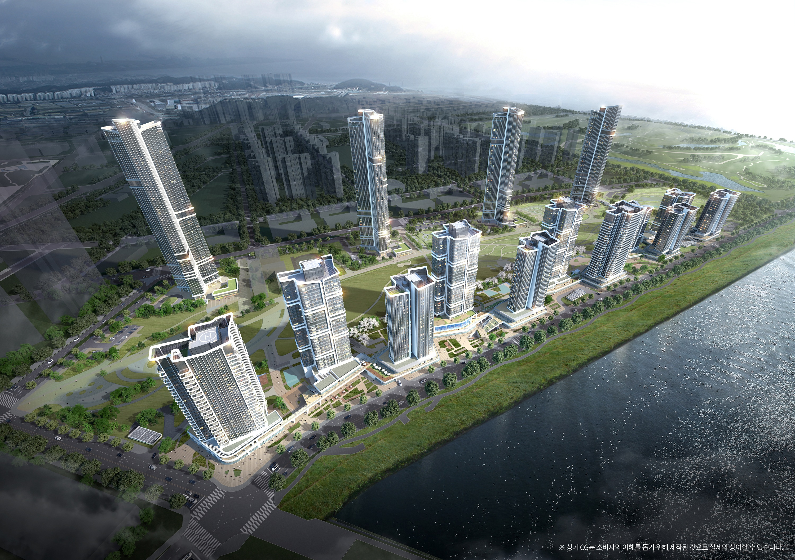
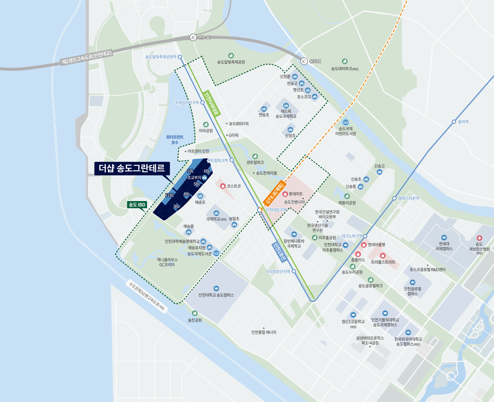

> **작성 기준일:** 2026년 5월 6일  
> **확인 범위:** 포스코그룹 뉴스룸, 구글 검색 노출 기준 최신 유튜브/네이버 블로그/분양 정보, 호갱노노·청약 관련 검색 결과  
> **주의:** 청약 일정과 공급 조건은 입주자모집공고 및 청약홈 최종 공고가 우선입니다. 실제 신청 전 반드시 청약홈과 공식 홈페이지를 재확인하세요.

*Figure 1: 더샵 송도그란테르 조감도. 송도 G5 블록의 전체 스카이라인과 워터프론트 입지를 보여줍니다. 출처: 포스코그룹 뉴스룸*

---

## 1. 오늘 확인한 최신 흐름: 송도 G5는 ‘일정 확인’ 단계입니다

**더샵 송도그란테르 청약 일정**은 2026년 5월 송도 분양 시장에서 가장 많이 검색되는 이슈 중 하나입니다. 단지는 인천 연수구 송도동 32번지 일원, 이른바 **송도 G5 블록**에 들어서는 대규모 주거 프로젝트입니다.

오늘 기준으로 확인한 핵심은 세 가지입니다.

1. **유튜브 오늘 날짜 영상:** 구글 동영상 검색에서 2026년 5월 6일 당일 업로드된 정확 일치 영상은 확인되지 않았습니다. 다만 1~3주 전 올라온 청약·모집공고 해설 영상들이 계속 노출되고 있습니다.
2. **네이버 블로그 오늘 날짜 포스팅:** 구글 인덱스 기준 `site:blog.naver.com` + 더샵 송도그란테르/송도 G5 조건에서 당일 신규 포스팅은 확인되지 않았습니다. 최근 노출 포스팅은 4월 16일, 4월 28일 자료가 중심입니다.
3. **분양 정보 최신성:** 포스코이앤씨 공식 보도자료와 주요 부동산 검색 결과 기준, 5월 청약 일정이 핵심입니다.

즉, 오늘 새로 나온 ‘확정 정보’보다는 **이미 공개된 일정과 공식 공고 확인 포인트를 정리해주는 글**이 검색 유입에 더 적합합니다.

---

## 2. 더샵 송도그란테르란? 송도 G5 블록의 핵심 개요

**더샵 송도그란테르**는 포스코이앤씨가 송도국제업무지구, 즉 IBD 내 G5 블록에 공급하는 주거 단지입니다. 포스코그룹 뉴스룸에 따르면 단지는 **G5-1·3·4·5·6·11블록**에 조성됩니다.

공식 보도자료 기준 주요 개요는 다음과 같습니다.

| 구분 | 내용 |
|---|---|
| 사업명 | 더샵 송도그란테르 |
| 위치 | 인천광역시 연수구 송도동 32번지 일원 |
| 블록 | G5-1·3·4·5·6·11블록 |
| 시공 | 포스코이앤씨 |
| 규모 | 지하 2층~지상 최고 46층, 15개 동 |
| 공급 | 아파트 1,544가구 + 주거형 오피스텔 96실 |
| 아파트 전용면적 | 84~198㎡ |
| 입주 예정 | 2029년 8월~2030년 1월, 블록별 상이 |
| 견본주택 예정지 | 인천 연수구 송도동 37-2번지 일원 |

이 단지가 주목받는 가장 큰 이유는 **입지 희소성**입니다. 포스코이앤씨는 이 단지를 송도 국제업무지구 내 마지막 주거단지로 설명하고 있습니다. 부동산에서 ‘마지막’이라는 표현은 단순한 홍보 문구가 아니라 공급 희소성과 연결됩니다. 같은 생활권에서 새 아파트 공급이 제한될수록, 청약 수요자 입장에서는 관심도가 높아질 수밖에 없습니다.

*Figure 2: 더샵 송도그란테르 위치도. 센트럴파크역, 워터프론트, 주요 생활 인프라와의 관계를 확인할 수 있습니다. 출처: 포스코그룹 뉴스룸*

---

## 3. 더샵 송도그란테르 청약 일정 Road Map

아래 로드맵은 오늘 확인한 검색 노출 정보와 청약 관련 공개 정보를 종합한 것입니다. 날짜는 변경 가능성이 있으므로 **청약홈 공고문 기준으로 최종 확인**해야 합니다.

### 🗺️ 청약 Road Map

| 단계 | 예정 일정 | 해야 할 일 | 체크포인트 |
|---|---:|---|---|
| ① 입주자모집공고 확인 | 2026.04.30 전후 | 청약홈/공식 홈페이지에서 공고문 다운로드 | 공급가, 발코니 확장비, 중도금 조건 확인 |
| ② 모델하우스 오픈 | 2026.05.08 전후 | 타입별 유닛, 옵션, 동·호수 배치 확인 | 실거주/투자 목적별 선호 블록 정리 |
| ③ 특별공급 청약 | 2026.05.11 전후 | 생애최초·신혼부부·다자녀 등 자격 확인 후 접수 | 자격 요건과 소득·자산 기준 사전 검증 |
| ④ 일반공급 1순위 | 2026.05.12 전후 | 청약통장 가입기간·예치금·지역 우선 확인 | 인천/수도권 배정, 추첨·가점 구조 확인 |
| ⑤ 일반공급 2순위 | 2026.05.13 전후 | 1순위 미달 또는 2순위 자격 시 접수 | 경쟁률 흐름 확인 |
| ⑥ 당첨자 발표 | 2026.05.19~05.21 전후 | 블록별 발표일 확인 | 중복청약 가능 여부와 발표일 순서 주의 |
| ⑦ 서류 제출·계약 | 발표 이후 | 자금계획·계약금·대출 가능성 점검 | 계약금 납부 일정, 전매제한, 실거주 의무 확인 |

### 로드맵에서 가장 중요한 포인트

첫째, **모집공고문을 먼저 봐야 합니다.** 블로그나 유튜브가 빠르게 정리해주더라도, 실제 청약 판단은 공고문이 기준입니다.

둘째, **블록별 당첨자 발표일이 다를 수 있습니다.** 송도 G5는 여러 블록으로 나뉘어 공급되는 구조라, 청약 전략에서 발표일 순서가 중요합니다. 중복 청약 가능성과 당첨자 발표일은 반드시 공고문으로 확인해야 합니다.

셋째, **분양가만 보지 말고 총액을 봐야 합니다.** 발코니 확장비, 유상 옵션, 중도금 이자 조건까지 합산해야 실제 부담 금액이 나옵니다.

---

## 4. 입지 분석: 왜 송도 G5가 주목받나

더샵 송도그란테르는 송도국제도시에서도 핵심으로 평가받는 **국제업무지구 IBD** 입지입니다. 포스코이앤씨 보도자료 기준, 단지는 인천지하철 1호선 **센트럴파크역 도보권**에 위치합니다. 인천대입구역에는 GTX-B 노선이 예정되어 있어 향후 광역 교통 기대감도 함께 붙습니다.

생활 인프라도 강점입니다. 코스트코, 현대프리미엄아울렛, 송도아트포레 등 상업시설 접근성이 좋고, 예송초·예송중·인천과학예술영재학교 등 교육 인프라도 언급됩니다. G5 블록 내 초등학교 부지도 계획돼 있다는 점은 실거주 수요자에게 중요한 포인트입니다.

또 하나의 키워드는 **워터프론트와 공원**입니다. 포스코이앤씨는 G5 블록 주변에 약 19만㎡ 규모 공원이 계획되어 있고, 단지 앞에는 송도 워터프론트가 자리한다고 밝혔습니다. 부동산에서 수변·공원 입지는 단순 조망 이상의 의미가 있습니다. 주거 쾌적성, 산책 동선, 커뮤니티 가치, 장기 선호도를 함께 끌어올리는 요소입니다.

---

## 5. 상품성 체크: 중대형 평형과 고급 설계 포인트

더샵 송도그란테르는 전용 84~198㎡로 구성됩니다. 중대형 위주의 평면이라는 점에서 실수요와 고급 주거 수요를 동시에 겨냥한 단지로 볼 수 있습니다.

공식 보도자료에서 눈에 띄는 설계 포인트는 다음과 같습니다.

- **최고 46층 스카이라인**: 송도 수변·도시 경관과 결합되는 상징성
- **UNStudio 협업 외관 설계**: 워터프론트 흐름과 도시 스카이라인 반영
- **3면 개방형 구조 일부 적용**: 채광과 환기, 개방감 강화
- **오픈 발코니 일부 도입**: 공원·수변 조망을 생활 공간으로 확장
- **펜트하우스 및 복층형 일부 구성**: 고급 주거 수요 대응
- **대규모 커뮤니티**: 수영장, 피트니스, 골프연습장, 스카이라운지, 프라이빗 스파 등 예정

특히 송도 신축 시장은 단순히 ‘새 아파트’라는 이유만으로 선택되기 어렵습니다. 이미 송도에는 다양한 브랜드 단지가 많기 때문입니다. 그래서 더샵 송도그란테르는 **입지 + 브랜드 + 수변·공원 + 상품 차별화**를 함께 봐야 합니다.

---

## 6. 청약 전 반드시 확인할 체크리스트

청약은 분위기로 들어가면 안 됩니다. 아래 체크리스트를 먼저 정리한 뒤 신청해야 합니다.

### ✅ 자격 체크

- 인천 거주자인지, 수도권 거주자인지 확인
- 청약통장 가입기간과 예치금 충족 여부 확인
- 세대주·무주택·1주택 여부 확인
- 특별공급 신청 시 소득·자산·혼인기간·자녀 수 등 세부 조건 확인

### ✅ 자금 체크

- 계약금 납부 가능 금액 확인
- 중도금 대출 가능성과 이자 조건 확인
- 잔금 시점의 대출 규제와 DSR 여력 확인
- 발코니 확장비와 유상 옵션 포함 총액 계산

### ✅ 전략 체크

- 블록별 세대수와 선호도를 비교
- 당첨자 발표일 순서 확인
- 중복청약 가능 여부 확인
- 실거주 목적이면 학교·역·상권 동선 우선 검토
- 투자 목적이면 전매제한, 실거주 의무, 입주 시점 공급량 확인

---

## 7. 오늘 기준 유튜브·블로그 체크 결과를 반영한 판단

오늘 날짜로 새롭게 확인되는 유튜브 영상이나 네이버 블로그 포스팅은 뚜렷하게 잡히지 않았습니다. 하지만 이건 관심이 식었다는 뜻이 아닙니다. 오히려 청약 일정 직전에는 유튜브와 블로그 콘텐츠가 이미 한 차례 쏟아진 뒤, 실제 공고문 기준으로 수요자들이 세부 조건을 확인하는 구간에 들어갑니다.

검색 노출 흐름을 보면 유튜브는 다음 주제들이 반복됩니다.

- 송도 G5 입지 분석
- 모집공고 일정 해설
- 1,544세대 대단지 규모
- 송도 마지막 IBD 주거단지 프리미엄
- 분양가와 청약 전략 예상

네이버 블로그 역시 비슷합니다.

- 단지 개요
- 예상 분양가
- 청약 일정
- 모델하우스 일정
- 블록별 장단점

따라서 이 글의 핵심은 단순 뉴스 재탕이 아니라, **청약자가 실제로 무엇을 확인하고 어떤 순서로 움직여야 하는지**를 Road Map으로 정리하는 데 있습니다.

---

## 8. 결론: 송도 G5 청약은 ‘일정·자격·자금’ 3개를 동시에 봐야 합니다

더샵 송도그란테르 청약 일정에서 가장 중요한 것은 속도보다 정확성입니다. 관심이 큰 단지일수록 영상과 블로그 정보가 많이 나오지만, 최종 판단은 입주자모집공고와 청약홈 기준으로 해야 합니다.

핵심만 정리하면 다음과 같습니다.

1. **입지:** 송도 IBD 내 G5 블록, 센트럴파크역·워터프론트·공원 입지
2. **규모:** 아파트 1,544가구, 주거형 오피스텔 96실, 최고 46층 대단지
3. **일정:** 5월 청약 로드맵 중심으로 움직이되 공고문 최종 확인 필수
4. **전략:** 블록별 발표일, 중복청약 가능 여부, 자금 계획을 함께 봐야 함

송도 G5는 관심도가 높은 만큼 경쟁도 만만치 않을 가능성이 있습니다. 청약을 준비한다면 오늘 할 일은 명확합니다. **공고문을 내려받고, 내 청약 자격과 자금 계획을 숫자로 먼저 정리하는 것**입니다.

---

## 자주 묻는 질문 FAQ

**Q: 더샵 송도그란테르 청약 일정은 언제인가요?**  
A: 2026년 5월 청약 일정이 핵심입니다. 검색 노출 기준으로 특별공급은 5월 11일 전후, 일반공급은 5월 12~13일 전후로 언급되지만, 실제 일정은 청약홈 입주자모집공고가 최종 기준입니다.

**Q: 송도 G5 블록은 왜 주목받나요?**  
A: 송도 국제업무지구 IBD 내 마지막 주거단지로 언급되는 희소성 때문입니다. 센트럴파크역, 워터프론트, 대형 공원 계획, 더샵 브랜드가 결합되어 관심이 높습니다.

**Q: 당첨자 발표일이 중요한 이유는 무엇인가요?**  
A: 여러 블록으로 나뉘어 공급되는 단지는 발표일 순서에 따라 중복청약 전략이 달라질 수 있습니다. 발표일이 다르면 청약 선택지가 늘어날 수 있으므로 공고문에서 반드시 확인해야 합니다.

**Q: 분양가만 보고 청약해도 될까요?**  
A: 아닙니다. 계약금, 중도금 대출 조건, 발코니 확장비, 유상 옵션, 잔금 시점 대출 가능성까지 합산해야 실제 부담 금액을 알 수 있습니다.

**Q: 유튜브와 블로그 정보만 믿어도 되나요?**  
A: 참고 자료로는 좋지만 최종 기준은 아닙니다. 청약은 청약홈, 입주자모집공고, 공식 홈페이지 자료가 우선입니다.

---

## 참고·출처

- 포스코그룹 뉴스룸, 「포스코이앤씨, 인천 ‘더샵 송도그란테르’ 4월 분양 예정」  
  https://newsroom.posco.com/kr/%ED%8F%AC%EC%8A%A4%EC%BD%94%EC%9D%B4%EC%95%A4%EC%94%A8-%EC%9D%B8%EC%B2%9C-%EB%8D%94%EC%83%B5-%EC%86%A1%EB%8F%84%EA%B7%B8%EB%9E%80%ED%85%8C%EB%A5%B4-4%EC%9B%94-%EB%B6%84%EC%96%91/
- 포스코이앤씨 더샵 공식 홈페이지  
  https://www.thesharp.co.kr/
- 청약홈  
  https://www.applyhome.co.kr/
- 구글 검색 확인: 2026년 5월 6일 기준, 더샵 송도그란테르/송도 G5 유튜브·네이버 블로그 최신 노출 확인

---

## About the Author

김과장은 EPC 플랜트 프로젝트 관리와 데이터 기반 의사결정에 익숙한 실무형 분석가입니다. 부동산 청약 글에서는 홍보성 표현보다 공고문, 일정, 자금 체크리스트처럼 실제 의사결정에 필요한 정보를 우선합니다.
