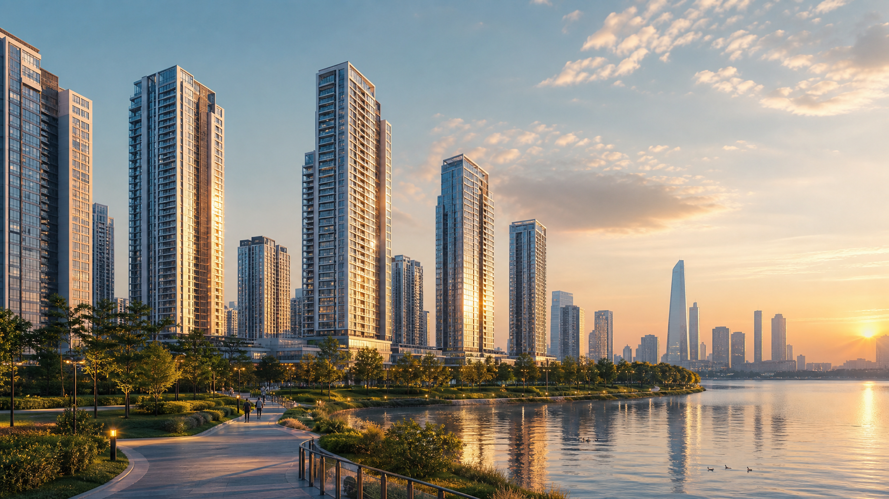

> **작성 기준일:** 2026년 5월 9일  
> **확인 기준:** 2026년 5월 7일 입주자모집공고 및 청약홈 공개 정보 기준 요약  
> **주의:** 최종 청약 판단은 반드시 청약홈과 블록별 입주자모집공고문 원문을 기준으로 확인해야 합니다. 분양가·대출·옵션·중복청약 가능 여부는 신청 화면과 공고문이 우선입니다.

인천 송도에서 오랫동안 관심을 받아온 **송도 G5블록**, 드디어 **더샵 송도그란테르 입주자모집공고**가 공개됐습니다.

송도국제도시 IBD 핵심 입지, 센트럴파크 생활권, 워터프런트 기대감까지 더해지면서 “송도 마지막 핵심 퍼즐”이라는 말이 나올 정도로 관심이 큰 단지입니다.

다만 이번 공고에서 가장 크게 주목받는 부분은 역시 **분양가**입니다. 전용 84㎡ 기준으로도 최고가가 12억~13억대에 형성되면서 “입지는 좋은데 가격이 너무 높은 것 아니냐”는 반응도 함께 나오고 있습니다.

이번 글에서는 청약공고 기준으로 **청약 일정, 블록별 특징, 분양가, 자금계획, 청약 시 주의사항**까지 정리해보겠습니다.

---

## 1. 더샵 송도그란테르 사업 개요

더샵 송도그란테르는 인천광역시 연수구 송도동 32번지 일대, 송도국제도시 G5블록에 공급되는 대형 주거복합 단지입니다.

| 구분 | 내용 |
|---|---|
| 단지명 | 더샵 송도그란테르 |
| 위치 | 인천광역시 연수구 송도동 32번지 일대 |
| 시행 | 케이비부동산신탁 |
| 시공 | 포스코이앤씨 |
| 규모 | 아파트 1,544세대 + 오피스텔 96실 |
| 총 규모 | 총 1,640세대 |
| 아파트 블록 | G5-1, G5-3, G5-4, G5-5, G5-6, G5-11 |
| 최고 층수 | 지상 최고 46층 |
| 입주 예정 | 2029년 8월 또는 2030년 1월, 블록별 상이 |

특이한 점은 하나의 단지처럼 보이지만 실제 청약은 **6개 블록으로 나뉘어 진행**된다는 점입니다. 따라서 “더샵 송도그란테르”라는 이름만 보고 판단하면 안 되고, 각 블록별 세대수, 분양가, 당첨자 발표일을 따로 확인해야 합니다.

---

## 2. 청약 일정 정리

청약 접수일은 6개 블록 모두 동일합니다.

| 구분 | 일정 |
|---|---:|
| 입주자모집공고일 | 2026년 5월 7일 |
| 특별공급 | 2026년 5월 19일 |
| 일반공급 1순위 | 2026년 5월 20일 |
| 일반공급 2순위 | 2026년 5월 21일 |
| 계약일 | 2026년 6월 13일 ~ 6월 16일 |

다만 **당첨자 발표일은 블록별로 다릅니다.**

| 블록 | 당첨자 발표일 |
|---|---:|
| G5-1 | 2026년 5월 28일 |
| G5-11 | 2026년 6월 1일 |
| G5-5 | 2026년 6월 1일 |
| G5-3 | 2026년 6월 2일 |
| G5-4 | 2026년 6월 2일 |
| G5-6 | 2026년 6월 2일 |

같은 당첨자 발표일 단지는 중복 청약에 제한이 있을 수 있습니다. 또 발표일이 다른 단지에 청약하더라도 먼저 당첨된 단지가 있으면 이후 당첨은 무효가 될 수 있으므로, 반드시 청약홈 신청 화면과 공고문을 함께 확인해야 합니다.

---

## 3. 블록별 세대수와 특징

| 블록 | 세대수 | 입주 예정 | 특징 |
|---|---:|---|---|
| G5-1 | 853세대 | 2029년 8월 | 가장 큰 규모, 주력 블록 |
| G5-11 | 318세대 | 2029년 8월 | 84㎡ 가격이 상대적으로 낮은 편 |
| G5-3 | 85세대 | 2030년 1월 | 소규모 고층 주상복합형 |
| G5-4 | 91세대 | 2030년 1월 | 일부 타입 가격 경쟁력 |
| G5-5 | 97세대 | 2030년 1월 | G5-11과 발표일 동일 |
| G5-6 | 100세대 | 2030년 1월 | 최고 46층 상징성 |

실거주 가족 수요라면 세대수가 큰 **G5-1, G5-11**을 먼저 볼 가능성이 높습니다. 반면 고층 조망, 희소성, 주상복합형 상품성을 중시한다면 **G5-3~6 블록**도 검토 대상입니다.

---

## 4. 분양가, 정말 13억일까?

이번 더샵 송도그란테르에서 가장 이슈가 된 부분은 분양가입니다.

청약공고 기준으로 전용 84㎡ 최고가는 대략 **12억 초반~13억 초반** 수준입니다.

| 블록 | 84㎡ 최고가 기준 |
|---|---:|
| G5-11 | 약 12.33억 |
| G5-4 | 약 12.51억 |
| G5-3 | 약 12.64억 |
| G5-5 | 약 12.81억 |
| G5-6 | 약 13.06억 |
| G5-1 | 약 13.08억~13.18억 |

즉 “84㎡가 13억”이라는 말은 일부 블록 기준으로는 맞습니다. 다만 모든 84㎡가 13억인 것은 아니고, **블록·타입·층·동호수별로 차이**가 있습니다.

대형 타입은 더 높습니다.

| 타입 구간 | 분양가 수준 |
|---|---:|
| 84㎡ | 약 12억~13억대 |
| 100~102㎡ | 약 14억 후반~15억 중반 |
| 124~129㎡ | 약 18억~22억대 |
| 188~198㎡ | 약 30억~33억대 |

특히 188㎡, 198㎡ 고가 타입은 30억을 넘기 때문에 단순 청약 경쟁률보다 **계약 유지 능력, 대출 가능성, 잔금 계획**이 훨씬 중요합니다.

---

## 5. 기존 송도 시세와 비교하면?

송도 핵심지의 기존 대장급 단지들과 비교하면 더샵 송도그란테르의 분양가는 확실히 높은 편입니다.

기존 송도 주요 단지 84㎡가 10억~12억대에서 거래되는 경우가 있었던 점을 감안하면, 이번 84㎡ 12억~13억대 분양가는 **신축 프리미엄, IBD 입지, 워터프런트 기대감**을 상당 부분 선반영한 가격으로 볼 수 있습니다.

따라서 단기 시세차익을 기대하기보다는 “2029~2030년 입주시점에 송도 핵심 신축을 이 가격에 보유할 가치가 있는가?”라는 관점으로 접근하는 것이 현실적입니다.

---

## 6. 자금계획이 핵심입니다

공고 기준 납부 구조는 대체로 다음과 같습니다.

| 구분 | 비율 |
|---|---:|
| 계약금 | 5% |
| 중도금 | 60% |
| 잔금 | 35% |

계약금은 계약 시 1차로 1,000만 원을 납부하고, 나머지 계약금은 계약 후 일정 기간 내 납부하는 구조입니다.

예를 들어 13억 원짜리 84㎡를 계약한다고 가정하면 계약금 5%는 약 **6,500만 원** 수준입니다. 계약 시 1,000만 원만 있으면 끝나는 것이 아니라, 나머지 계약금도 곧바로 준비해야 합니다.

또한 중도금 이자후불제가 적용되더라도 이자가 사라지는 것이 아니라 **입주시점에 정산해야 하는 비용**입니다. 분양가, 옵션비, 중도금 이자, 취득세, 잔금 대출까지 함께 계산해야 합니다.

---

## 7. 청약 자격 핵심 체크

공고 기준 주요 내용은 다음과 같습니다.

| 구분 | 내용 |
|---|---|
| 지역 | 인천 및 수도권 거주자 |
| 주택유형 | 민영주택 |
| 규제 여부 | 비규제지역 |
| 재당첨 제한 | 없음 |
| 전매 제한 | 6개월 |
| 거주의무 | 없음 |
| 분양가상한제 | 미적용 |

일반공급 1순위는 청약통장 가입기간과 예치금 기준을 충족해야 합니다. 특별공급은 유형별로 무주택, 소득, 자산, 세대주 요건 등이 다르기 때문에 별도 확인이 필요합니다.

또 84㎡는 가점제와 추첨제가 섞여 있고, 85㎡ 초과 타입은 추첨제 중심으로 진행됩니다. 유주택자도 일반공급 청약은 가능하지만, 추첨제에서도 무주택자 우선공급 구조가 있기 때문에 당첨 가능성은 타입별로 달라질 수 있습니다.

---

## 8. 장점과 리스크

### 장점

1. 송도 IBD 핵심 입지
2. 센트럴파크 생활권
3. 워터프런트 기대감
4. 포스코이앤씨 더샵 브랜드
5. 2029~2030년 입주 신축 프리미엄
6. 전매제한 6개월, 거주의무 없음

### 리스크

1. 분양가가 높다
2. 기존 송도 시세 대비 가격 부담이 있다
3. 6개 블록으로 나뉘어 단지별 선호도 차이가 생길 수 있다
4. 중도금 대출 조건은 최종 확정 전까지 변동 가능성이 있다
5. 유상옵션 비용이 추가될 수 있다
6. 대형 타입은 향후 매수자 풀이 제한적일 수 있다

---

## 9. 청약 전략은 이렇게 보는 게 좋습니다

### 실거주 중심이라면

가장 먼저 볼 블록은 **G5-1, G5-11**입니다. 세대수가 크고 아파트 단지로서의 안정감이 있기 때문입니다.

### 84㎡ 가격을 중요하게 본다면

상대적으로 84㎡ 최고가가 낮은 **G5-11, G5-4**를 비교해볼 만합니다.

### 대단지 선호라면

853세대 규모의 **G5-1**이 가장 무난한 선택지입니다.

### 고층·조망·희소성을 본다면

**G5-3, G5-4, G5-5, G5-6**도 검토 대상입니다. 다만 세대수가 적기 때문에 향후 관리비, 커뮤니티, 동선, 실거주 편의성은 꼼꼼히 봐야 합니다.

---

## 10. 결론: 좋은 입지지만, 가격 검증은 냉정하게

더샵 송도그란테르는 송도에서 상징성이 큰 입지에 들어서는 단지입니다. IBD 핵심 생활권, 워터프런트 기대감, 더샵 브랜드, 신축 프리미엄까지 고려하면 분명 관심을 받을 만한 단지입니다.

하지만 분양가 역시 만만치 않습니다. 84㎡도 12억~13억대, 대형 타입은 30억을 넘기기 때문에 단순히 “송도 핵심 입지니까 괜찮다”로 접근하기에는 부담이 큽니다.

이번 청약은 시세차익보다 **내가 2029~2030년 입주시점까지 자금계획을 유지할 수 있는지**, 그리고 **송도 핵심 신축을 장기 보유할 의지가 있는지**가 핵심입니다.

청약 전에는 반드시 아래 3가지를 확인하시기 바랍니다.

1. 블록별 입주자모집공고문
2. 동·호수별 실제 분양가
3. 중도금 대출, 옵션비, 잔금계획

입지는 좋습니다. 다만 가격도 강합니다. 그래서 이번 더샵 송도그란테르 청약은 “무조건 넣는 청약”이라기보다 **자금 여력과 실거주 목적이 명확한 분들에게 맞는 청약**으로 보는 것이 현실적입니다.

---

## 팩트체크 메모

- 입주자모집공고일: 2026년 5월 7일
- 특별공급: 2026년 5월 19일
- 1순위: 2026년 5월 20일
- 2순위: 2026년 5월 21일
- 전매제한: 6개월
- 거주의무: 없음
- 재당첨제한: 없음
- 분양가상한제: 미적용
- 84㎡ 최고가: 약 12.33억~13.18억 수준
- 최고가 타입: 일부 198㎡ 약 33억대

※ 최종 청약 전에는 반드시 청약홈 및 입주자모집공고문 원문을 확인해야 합니다.
