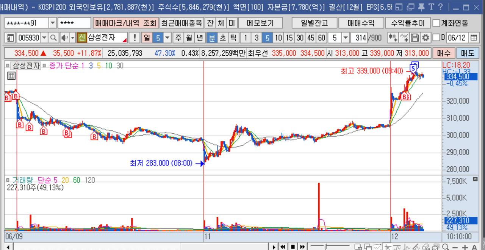

# AI 매매일지 | 2026-06-12

> **오늘의 운영 모드:** 수익 보존 모드  
> **핵심 원칙:** 수익 보존 우선, 무리한 추가 매매 금지

## Dashboard

| 항목 | 값 |
|---|---:|
| 총 실현손익 | 14,500원 |
| 승 / 패 | 1승 / 0패 |
| 복기 종목 수 | 1종목 |
| 포지션 관리 | 수익 보존 우선, 무리한 추가 매매 금지 |

## Market Context
2026-06-12 오전장은 IT 대표주와 반도체 대표주가 강했고, 삼성전자와 SK하이닉스 중심으로 대형주 수급이 확산됐다. 장초반 급등주는 추격보다 거래대금 유지와 눌림 지지 확인이 중요하다.

## Voice Memo
삼성전자 스윙. 박스권 상단 돌파와 거래량 급증, 반도체 대형주 수급 확산을 보고 진입. 급등 첫날이라 고점 추격보다 330000원 위 지지와 320000원 이탈 여부를 핵심 관리 기준으로 둔다.

## Evidence
첨부 스크린샷:

OCR/차트 판독은 다음 단계에서 pytesseract 또는 vision 모델로 확장

## Trade Review

---

### 1. 삼성전자 (005930)

| 구분 | 내용 |
|---|---:|
| 기법 분류 | 돌파추종 |
| 매수 수량 / 평단 | 1주 / 320,000원 |
| 매도 수량 / 평단 | 1주 / 334,500원 |
| 실현손익 | 14,500원 (+4.53%) |

#### 관련 뉴스
- [[특징주] 미국발 훈풍에 삼성전자·하이닉스 장초반 9%대 급등](https://news.google.com/rss/articles/CBMiW0FVX3lxTFB0QlowaGhhV016ZVlWc3RNR3VJM1VnN2RnbVRDNFViZVNRN19nZlpGOFE1VG1BYk5KSlBPRUhzTE9Wdk1JVXJkNkdqVDVJRUZ0LVpnUVp3OUdTUnfSAWBBVV95cUxPamgtSE9PcUR0TExvYTNBOS1pS2xaWkpsdWxUMUlyOGVGTVJEWUJuRDVxakxoT3ZCX2RySDdPcUpYMHRqaGVqcE04UzY0VXRia3JnMXNUY0N3UDNvNEZyQV8?oc=5) (연합뉴스 · Fri, 12 Jun 2026 00:19:47 GMT)
- [[ET특징주] 삼성전자·SK하이닉스, 급락 하루 만에 반등](https://news.google.com/rss/articles/CBMiTkFVX3lxTE11dmdaWjN3bnBnQmgyMU5nczIzeFpTaG41NEE4Vnk5b3hCejZJTkxxUnlnZk84V2hNemVnYnJyd0ZNUnNYQm5oaWNHYVdPdw?oc=5) (전자신문 · Tue, 09 Jun 2026 02:06:13 GMT)
- [[ET특징주] 젠슨 황 “AI 미래 매우 밝다”… 삼성전자·SK하이닉스 30만·200만선 회복](https://news.google.com/rss/articles/CBMiTkFVX3lxTE53aU1zRndjbGpPenJnR0pvbEhDN2x5YlExc2hlNWh3U0NvNTlZZWtxUVVyMjdET2RMQUI0NEswdVFHOTgxbHMzM1phY1NQdw?oc=5) (전자신문 · Mon, 08 Jun 2026 02:20:49 GMT)

#### 3박자 체크

**A. 재료**
- 당일 핵심 뉴스/실적/시간외/NXT 이슈:
- 재료 지속성: 강 / 중 / 약

**B. 차트 및 거래대금**
- 일봉 위치: 신고가 / 박스권 돌파 / 역배열 / 과열 / 기타
- 분봉 지지/저항: 진입 전 확인 / 이탈 후 대응 / 미확인
- 거래대금: 150억 이상 여부와 장중 증가율 확인

**C. 수급**
- 프로그램 매수/매도 추이:
- 외국인/기관/연기금/투신 연속 매수 여부:

#### 진입 및 청산 타점
- 진입 근거:
- 청산 근거:
- 분할매매 요약:
  - 09:05 매수 1주 @ 320,000원
  - 10:12 매도 1주 @ 334,500원

#### 오답노트 / 피드백
- 수익 거래: 익절 근거가 계획과 일치했는지 확인
- 더 좋은 청산 타점이 있었는지 분봉 기준 복기

---

## Tomorrow Rules
- 손절선은 진입 전 숫자로 먼저 적는다.
- 프로그램 대량 매도 전환 시 추가 매수 금지.
- 재료가 약한 종목은 거래대금 유지가 꺾이면 빠르게 축소.
- 수익 후 추가 매매는 1회만 허용하고, 이후 관망.
